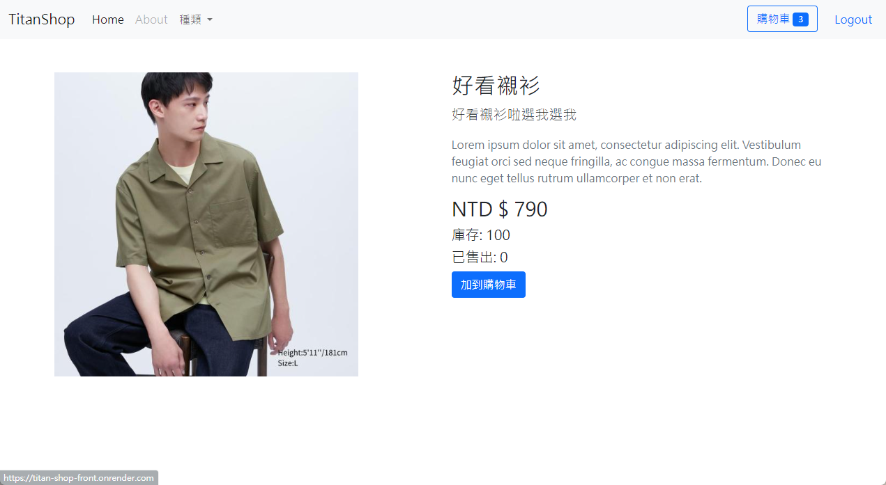
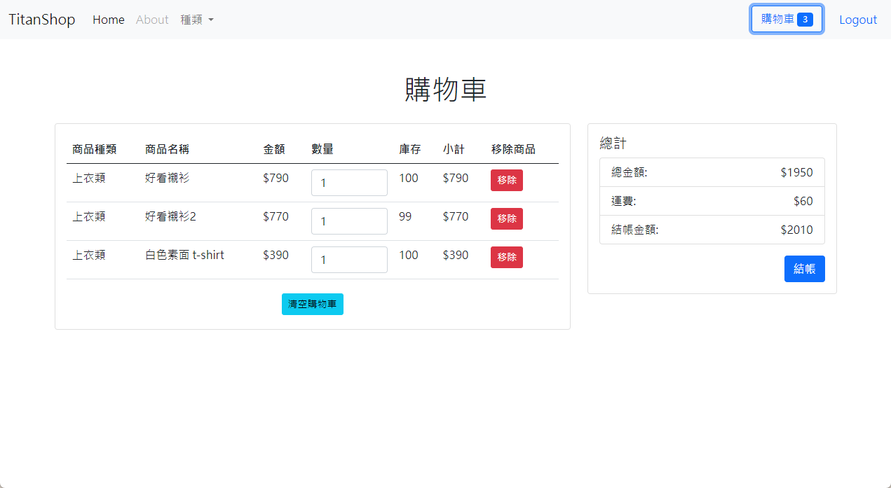
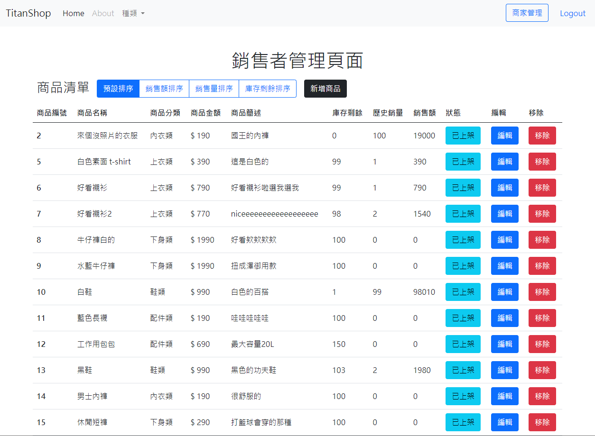

# Titan Shop Front-end

鈦坦挑戰-商店專案

---

## Project Preview

---

## About The Project

這是一個基於Vue 3、Bootstrap 5、MySQL（AWS RDS佈署） 和 Express.js的前後端分離商店專案，而您現在瀏覽的是前端部份，該專案目的為提供一個使用者友好且具備基本功能的購物網站，讓使用者可以方便地瀏覽商品、新增商品到購物車並進行結帳，而管理者則能透過管理頁瀏覽目前的銷售狀況及新增、編輯商品。

使用者
1. 前台使用者可以通過網站瀏覽各種商品，並且可以根據商品種類、價格範圍等進行篩選及排序。
2. 每個商品頁面都有詳細的描述、價格和庫存訊息，讓使用者可以快了解商品。
3. 使用者可以選擇將商品加入購物車，並隨時查看購物車內的商品數量和總金額。
4. 使用者可以在購物清單中對商品數量進行調整，並在同個頁面中送出訂單。

管理者
1. 管理者可以在網站主頁下架商品。
2. 管理頁面可以進行銷售額、銷售量、庫存數量的排序。
3. 頁面中也能新增及編輯商品，或調整上、下架及移除商品。

為了實現這些功能，前端部分使用了Vue 3作為主要框架，Bootstrap 5用於設計元件和排版，使網站在不同設備上都能具有良好的響應式設計。
後端部分使用了Express.js作為 Web API 框架，處理來自前端的請求並與MySQL數據庫存取資料。

資料庫中儲存了商品的詳細資訊，包含名稱、價格、種類、庫存、總銷售量等。當使用者新增商品到購物車時，前端會將請求傳送到後端，後端會將相應的商品數量更新到資料庫中，並將最新的購物車內容返回給前端。

而登入功能讓使用者可以通過登入來保存他們的購物車內容，並查看訂單紀錄等。

總結來說，這個商店前後端分離網頁專案提供了一個完整的購物網站解決方案，讓使用者可以輕鬆地購買商品並享受愉快的購物體驗。該專案整合了多種技術和框架，是一個值得學習和參考的項目。

### Built with

- Vue 3
- Vue-Router
- Pinia
- CSS
- Bootstrap

### Deploy with
- Render

---
## Getting Started

### Prerequisites

請先確認本機已安裝 Node.js 18.16.0 與 npm 9.6.7 版本

### Installation

1. 將專案 clone 至本地: 

   `git clone https://github.com/Chingsan0722/titan-shop-frontend`

2. 在 git bash 或 PowerShell 中移動到該資料夾並載入組件:

   `cd titan-shop-frontend` `npm install`

3-1-1. 安裝結束後，將專案進行打包:

  `npm build` 
     
3-1-2. 打包完成後，輸入 `npm run preview` 運行專案

3-2. 或使用開發環境運行專案

  `npm run dev`

4. 在瀏覽器中寫入網址 

npm run preview: http://localhost:4173/

or

npm run dev: http://localhost:5173/

5. 使用者與管理者種子帳號登入（目前尚未開發註冊功能）

使用者：
  帳號 : buyer001 ～ buyer005
  密碼 : titaner

管理者：
  帳號 : seller001
  密碼 : titaner

---
請注意：此為前後分離的專案，若要與後端 API 連線須先同步將後端專案 clone 至本地，並啟動運作，再到  `./src/api/axiosInstance.js` 將網址變更為後端伺服器網址
## Website 

[Render page](https://titan-shop-front.onrender.com/)

開啟後若無內容，可能須等待後端 server 啟動，約需時 1 分鐘。

## Backend Link

[repo](https://github.com/Chingsan0722/titan-shop-backend)

---

## Contact

[Ching Lin](rory85722@gmail.com)

---

## Acknowledgment

Front-end, Back-end: Ching Lin

---
